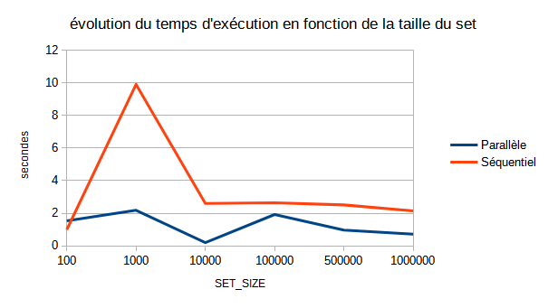
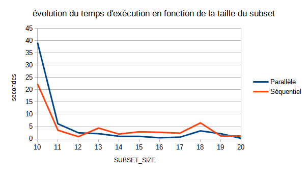

# Présentation de l'algorithme
L'algorithme qui a été choisi est le second présenté dans l'article : [New Algorithms for Subset Sum Problem, by Zhengjun Cao and Lihua Liu](https://arxiv.org/pdf/1807.02611.pdf).
Il s'agit d'un algorithme probabiliste, c'est-à-dire, qu'il utilise de l'aléatoire.
## Principe de base en séquentiel
Le principe du code est explicité aux pages 5 et 6 de l'article. Il se compose en 4 étapes :
- Mélanger le set de départ et en récupérer une partie (un subset).
- Exécuter un algorithme glouton sur ce subset : C'est-à-dire que si le subset est [w1, w2, w3] et que l'on a pour "target" T, nous calculons : [T, T-w1, T-w2, T-w1-w2, T-w3, T-w1-w3, T-w2-w3, T-w1-w2-w3]
- Si le tableau obtenu contient un zéro, nous avons trouvé une solution au problème.
- Sinon, on recommence à l'étape 1.


### Limite 1 : Nombre d'itérations
Cet algorithme permet d'exécuter l'algorithme glouton (étape 2) sur des subset du set principal, et donc d'en limiter la complexité. Si l'on considère n la taille du set et k la taille du subset (avec k < n), la complexité devient 2<sup>k</sup> au lieu de 2<sup>n</sup>.


Cependant, il faut donner un nombre d'itérations maximales pour éviter des boucles infinies en cas d'absence de solution. Ainsi, si jamais nous atteignons ce nombre maximal d'itérations, le programme nous dit qu'il n'y a pas de solution, mais nous ne pouvons pas en être certains.


### Limite 2 : Bien choisir la taille du subset
Comme nous l'avons vu précédemment, le choix de la taille du subset est importante. Si on le choisit trop petit par rapport à la solution, on ne trouvera jamais une solution au problème, malgré son existence.


Si l'on souhaite choisir une taille de subset trop grande pour être sûr de trouver la solution, on perd tout l'intérêt de l'algorithme. En effet, k tend vers n, et donc la complexité se rapproche de la complexité de l'algorithme glouton.


Le dernier point de blocage concerne l'utilisation mémoire de l'étape 3. En effet, cette dernière nécessite de créer un tableau de taille 2<sup>k</sup>. Ainsi, si la solution contient 30 éléments, il nous faut un subset de taille 30 minimum, et donc créer un tableau de taille 2<sup>30</sup>=1073741824. Cela occupe donc beaucoup d'espace mémoire et prend également beaucoup de temps à être construit.


## Principe de base en parallèle
Le principe est le même, cependant on cherche à évaluer plusieurs subsets différents en parallèle.
Ainsi, on a un unique "pragma omp parallel" dans la fonction "keepGoing_p" afin de paralléliser cette partie. On a tout de même rajouté deux zones critiques :
1) Affichage de la solution : Mettre une zone critique ici, garanti que l'affichage de la solution trouvée soit effectué proprement.
2) Déterminer si une fonction a été trouvée et compter le nombre effectif d'itérations effectuées.


Mettre "#pragma omp parallel" à l'intérieur de la boucle for permet de rajouter la ligne "if (validate) break;" juste avant. Ainsi, si une solution est trouvée, nous stoppons le programme. Si nous avions parallélisé toute boucle, nous aurions dû mettre "if (validate) continue;". Ainsi, cela aurait économisé l'exécution de toutes les instructions de la boucle, mais le thread aurait tout de même dû faire toutes les itérations (plusieurs millions).


# Études de performances
## Première implémentation séquentielle
Lors de la première implémentation, je n'avais pas de subset à proprement parler. Je mélangeais le set initial, et je considérais les k premiers éléments de ce dernier. Cette méthode, bien que plus simple, prend aussi plus de temps lors de l'exécution.
Lors de l'exécution de mon programme sur un set de taille 1000, en faisant en sorte de tomber sur le pire cas (on ne trouve pas de solution), le temps moyen est décomposé de la manière suivante :


|||
| :--------------- |:---------------:|
|Shuffling time   | 7.04 s |
|Computing time   | 1.13 s |
|Total | 8.17 s|


Afin de réduire le temps nécessaire, j'ai choisi de changer la manière de construire le subset.
## Seconde implémentation séquentielle
Cette fois, le subset devient un tableau d'unsigned long de taille k. Pour le remplir, je choisis aléatoirement k éléments du set original.
Cette nouvelle méthode permet d'avoir une complexité de la phase de "Shuffling" presque constante.


Même si c'est plus long à implémenter, notamment, car il faut s'assurer de ne pas choisir plusieurs fois le même élément, le gain en temps est très important puisque l'on obtient les résultats suivant (dans les mêmes conditions que précédemment) :


|||
| :--------------- |:---------------:|
|Shuffling time   | 0.17 s |
|Computing time   | 1.16 s |
|Total | 1.33 s|


## Variation en fonction de la taille du subset et du set
Dans cette section, j'ai mesuré le temps d'exécution du programme en faisant varier la taille du set (avec SUBSET_SIZE valant 15), puis en faisant varier la taille du subset (avec SET_SIZE valant 500 000). Pour chaque cas, on exécute le code cinq fois puis on fait la moyenne du temps d'exécution.


Dans le cas de l'exécution parallèle, on doit également diviser le temps d'exécution par le nombre de threads utilisés pour obtenir le temps effectif.


Après avoir effectué toutes les exécutions, nous obtenons les diagrammes suivants :


<p>
    
    
</p>


Dans les deux cas, il y a peu de différence entre les deux (même si l'exécution parallèle est un peu plus rapide). Cela peut s'expliquer par l'aspect aléatoire de notre solution.


# Exécuter le programme
## Inputs
Afin d'exécuter les algorithmes, il y a deux options possibles. La fonction "execution_seq" (ou "execution_p" pour l'exécution parallèle) prendra des valeurs de "SUBSET_SIZE" (appelé précédemment k) et de "LOOP" (nombre maximal d'itérations) par défaut (respectivement 15 et 10000000).
Pour spécifier manuellement ces valeurs, il faut utiliser les fonctions "executuon_test_seq" ou "execution_test_p".


Dans les deux cas, les paramètres sont les suivants (dans l'ordre) :
- ```unsigned long* set``` : Le set de nombre considéré dans le problème.
- ```unsigned long target``` : La somme recherchée dans le set.
- ```size_t set_size``` : La taille du set.
- ```size_t subset_size``` : (cas où la fonction de test est appelée) la taille du subset à considérer.
- ```int loop``` : (cas où la fonction de test est appelée) Le nombre maximal d'itérations.


Dans le cas de l'exécution parallèle, il est possible d'appeler la fonction "set_number_of_threads" qui prend en paramètre un nombre de threads (int). Par défaut, le nombre de threads est fixé à 5.


## Outputs


Lors de l'exécution, le programme va commencer par indiquer certain des paramètres utilisés :
- Le nombre maximal d'itérations.
- La taille du subset.
- La taille du set.
- Le nombre de threads utilisés dans le cas d'une exécution parallèle.


L'output finale du programme est la suivante :
- Un booléen indiquant si une solution a été trouvée (1) ou non (0).
- Le nombre d'itérations réalisées.
- La solution trouvée si elle l'a été.